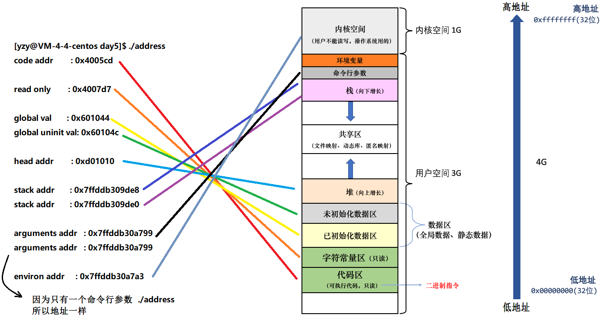

## 一些常用的查看elf文件的命令

- **基本的虚拟地址空间表**

- 

- **读取可执行文件的ELF头文件信息**

```shell
readelf -h ./dlsym_strlen 
ELF Header:
  Magic:   7f 45 4c 46 02 01 01 00 00 00 00 00 00 00 00 00 
    // 文件标识，前四个字节 0x7F 'E' 'L' 'F' 固定，表示 ELF 文件格式
    // 后面的字节表示 ELF 版本、填充字节等

  Class:                             ELF64
    // ELF 文件类型，ELF64 表示 64 位可执行文件

  Data:                              2's complement, little endian
    // 数据存储方式：二进制补码，小端序（低地址存低位）

  Version:                           1 (current)
    // ELF 版本号，当前为 1

  OS/ABI:                            UNIX - System V
    // 目标操作系统/ABI，这里是 UNIX System V（最通用的 Linux/Unix ABI）

  ABI Version:                       0
    // ABI 版本号，一般是 0 表示默认

  Type:                              DYN (Position-Independent Executable file)
    // 文件类型：DYN 表示动态可执行文件（PIE）
    // 即编译时用了 -fPIE，运行时配合 ASLR 可以加载到任意基址

  Machine:                           Advanced Micro Devices X86-64
    // 目标体系结构，这里是 x86-64 架构（AMD64，兼容 Intel 64）

  Version:                           0x1
    // ELF 的内部版本号

  Entry point address:               0x10e0
    // 程序入口地址（_start 函数的虚拟地址）

  Start of program headers:          64 (bytes into file)
    // 程序头表（Program Header Table）的偏移，64 字节处

  Start of section headers:          14488 (bytes into file)
    // 段头表（Section Header Table）的偏移，文件内 14488 字节处

  Flags:                             0x0
    // 特定架构相关的标志位，x86-64 下一般为 0

  Size of this header:               64 (bytes)
    // ELF 头本身大小：64 字节

  Size of program headers:           56 (bytes)
    // 每个 Program Header 条目的大小：56 字节

  Number of program headers:         13
    // Program Header 的数量：13 个

  Size of section headers:           64 (bytes)
    // 每个 Section Header 条目的大小：64 字节

  Number of section headers:         31
    // Section Header 的数量：31 个

  Section header string table index: 30
    // 字符串表在 Section Header 表中的索引（30）
    // 用于保存各段的名字（.text, .data, .bss 等）
```

- **查看ELF 文件程序头表信息**

```shell
readelf -l ./dlsym_strlen 

Elf file type is DYN (Position-Independent Executable file) 
// 文件类型：动态可执行文件（PIE）

Entry point 0x10e0
// 程序入口地址，执行时从这里开始（通常对应 _start）

There are 13 program headers, starting at offset 64
// 总共有 13 个 Program Header，从文件偏移 0x40 开始

Program Headers:
  Type           Offset             VirtAddr           PhysAddr
                 FileSiz            MemSiz              Flags  Align
  PHDR           0x0000000000000040 0x0000000000000040 0x0000000000000040
                 0x00000000000002d8 0x00000000000002d8  R      0x8
  INTERP         0x0000000000000318 0x0000000000000318 0x0000000000000318
                 0x000000000000001c 0x000000000000001c  R      0x1
      [Requesting program interpreter: /lib64/ld-linux-x86-64.so.2]
  LOAD           0x0000000000000000 0x0000000000000000 0x0000000000000000
                 0x0000000000000910 0x0000000000000910  R      0x1000
  LOAD           0x0000000000001000 0x0000000000001000 0x0000000000001000
                 0x0000000000000411 0x0000000000000411  R E    0x1000
  LOAD           0x0000000000002000 0x0000000000002000 0x0000000000002000
                 0x000000000000024c 0x000000000000024c  R      0x1000
  LOAD           0x0000000000002d78 0x0000000000003d78 0x0000000000003d78
                 0x0000000000000298 0x00000000000002b8  RW     0x1000
  DYNAMIC        0x0000000000002d90 0x0000000000003d90 0x0000000000003d90
                 0x0000000000000200 0x0000000000000200  RW     0x8
  NOTE           0x0000000000000338 0x0000000000000338 0x0000000000000338
                 0x0000000000000030 0x0000000000000030  R      0x8
  NOTE           0x0000000000000368 0x0000000000000368 0x0000000000000368
                 0x0000000000000044 0x0000000000000044  R      0x4
  GNU_PROPERTY   0x0000000000000338 0x0000000000000338 0x0000000000000338
                 0x0000000000000030 0x0000000000000030  R      0x8
  GNU_EH_FRAME   0x00000000000020f4 0x00000000000020f4 0x00000000000020f4
                 0x000000000000004c 0x000000000000004c  R      0x4
  GNU_STACK      0x0000000000000000 0x0000000000000000 0x0000000000000000
                 0x0000000000000000 0x0000000000000000  RW     0x10
  GNU_RELRO      0x0000000000002d78 0x0000000000003d78 0x0000000000003d78
                 0x0000000000000288 0x0000000000000288  R      0x1
//**
    依次这样排序的:
        PHDR : 就是 Program Header Table 本身，它告诉操作系统和动态链接器如何加载 ELF 的其他部分；同时它被映射到内存中，方便运行时访问。
        INTERP : Program Interpreter 动态链接器的路径 对于静态库来说是没有，对于动态库来说是有的，静态库是直接编译进去了
        LOAD (只读数据段) : 加载到内存的第一个段，包含 ELF header 等元信息
        LOAD (代码段) : 包含代码段 .text（可执行指令）
        LOAD (只读常量) : 包含 .rodata（只读数据）和异常处理表
        LOAD (数据段) : 包含 .data（已初始化数据）、.bss（未初始化数据）、.got（全局偏移表）
        DYNAMIC ：动态链接信息表，告诉动态链接器需要加载哪些库，如何做重定位
        NOTE 段 : 存放编译信息和 ABI 信息
        GNU_PROPERTY : GNU 扩展属性，描述安全特性（如 CET、BTI、PIE 等）
        GNU_EH_FRAME : 异常处理帧表头，用于 C++ 异常、栈回溯
        GNU_STACK : 栈段权限，这里是 RW（可读写），不可执行、 提供 NX（No eXecute）保护，防止栈溢出攻击
        GNU_RELRO : RELocation Read-Only 段、 程序运行时，先 RW 修正 GOT/全局数据地址、 之后变成 RO，防止运行时被恶意篡改    
**//

Section to Segment mapping:
    Segment Sections...
        00     // PHDR 自己
        01     .interp                  // 动态链接器路径
        02     .interp .note.* .dynsym ... .rela.plt   // 动态链接相关
        03     .init .plt .plt.got .plt.sec .text .fini // 代码段
        04     .rodata .eh_frame*       // 只读数据 + 异常帧
        05     .init_array .fini_array .dynamic .got .data .bss  // 数据段
        06     .dynamic                 // 动态链接表
        07     .note.gnu.property       // NOTE 段
        08     .note.gnu.build-id .note.ABI-tag // NOTE 段
        09     .note.gnu.property       // NOTE 段（重复映射）
        10     .eh_frame_hdr            // 异常帧表
        11     // GNU_STACK，不需要 Section
        12     .init_array .fini_array .dynamic .got // RELRO 保护区域
```

## 一些反汇编的命令

```bash

```

## 查看动态链接库与静态链接库的命令

```bash

```