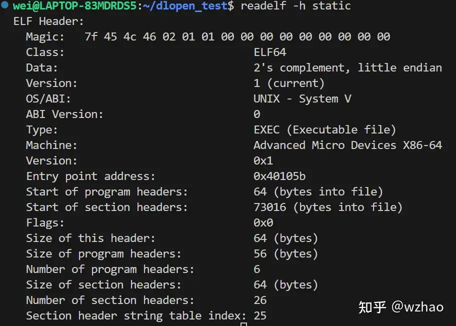
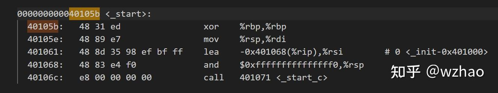

## 引用文章部分

- [对应的文章](https://www.zhihu.com/question/647572534/answer/3574446310)


## 解析实际

- 在Linux上`Executable file和Position-Independent Executable file`的执行是有区别的，区别在与`Position-Independent Executable file`需要借助动态链接器（ldso）来运行，而`Executable file`不需要，它们在执行main函数前会经过不同的流程。

### Executable file

- 对于可执行文件是静态链接而成的，执行前无需借助动态链接ldso来进行加载和重定位



- 对应入口（Entry point address）是0x40105b，可以进行反汇编看一下(objdump)



- `这就是该种类型的可执行文件执行的第一个函数，在该函数执行前%rsp寄存器会指向这样一块内存区域，叫做Initial Process Stack，`它是操作系统为进程的执行所准备的栈，之后的libc初始化工作都需要使用到这个栈。Initial Process Stack的布局如下图所示：

##### 对应_start函数在musl中的源码如下:

```cpp
__asm__(
".text \n"
".global " START " \n"
START ": \n"
"   xor %rbp,%rbp \n"
"   mov %rsp,%rdi \n"
".weak _DYNAMIC \n"
".hidden _DYNAMIC \n"
"   lea _DYNAMIC(%rip),%rsi \n"
"   andq $-16,%rsp \n"
"   call " START "_c \n"
);
```
- 这个函数干的事情有：
    - 将%rbp寄存器置0
    - 将栈指针%rsp的值传给%rdi（%rdi是第一个参数）
    - 计算_DYNAMIC符号的地址并传给%rsi寄存器。（%rsi是第二个参数，不过在Executable file中_DYNAMIC并不会被使用）
    - 将栈指针%rsp按16字节对齐
    - 调用_start_c函数
- **`rbp（Base Pointer，基址指针）是一个专用寄存器，其核心作用是维护当前函数调用栈的 “基准地址”，用于定位栈帧内的局部变量、函数参数以及保存的寄存器值。`**

#### 对应的_start_c函数

```cpp
void _start_c(long *p)
{
 int argc = p[0];
 char **argv = (void *)(p+1);
 __libc_start_main(main, argc, argv, _init, _fini, 0);
}
```

- `这个函数会获取argc和argv的值（p就是之前汇编代码设置的%rdi，它指向Initial Process Stack）`，然后调用__libc_start_main函数，__libc_start_main函数如下所示：

```cpp
int __libc_start_main(int (*main)(int,char **,char **), int argc, char **argv,
 void (*init_dummy)(), void(*fini_dummy)(), void(*ldso_dummy)())
{
 char **envp = argv+argc+1;

    /* External linkage, and explicit noinline attribute if available,
     * are used to prevent the stack frame used during init from
     * persisting for the entire process lifetime. */
 __init_libc(envp, argv[0]);

    /* Barrier against hoisting application code or anything using ssp
     * or thread pointer prior to its initialization above. */
 lsm2_fn *stage2 = libc_start_main_stage2;
 __asm__ ( "" : "+r"(stage2) : : "memory" );
 return stage2(main, argc, argv);
}
```
- __libc_start_main函数会调用__init_libc函数对初始化libc（包括设置envp、aux，初始化tls等），之后进入第二阶段libc_start_main_stage2。

- 在libc_start_main_stage2函数中会做执行前所需的最后一件事，调用__libc_start_init函数执行.init段和.init_array段中的函数，libc_start_main_stage2函数的代码如下所示：

```cpp
static int libc_start_main_stage2(int (*main)(int,char **,char **), int argc, char **argv)
{
 char **envp = argv+argc+1;
 __libc_start_init();

    /* Pass control to the application */
 exit(main(argc, argv, envp));
 return 0;
}
```

- .init_array段中的函数可以是用户编写的需要在main函数之前执行的函数，比如在C语言中可以使用__attribute__((constructor))来将一个函数放在main函数之前执行：

```cpp
__attribute__((constructor)) void init() { puts("init"); }
```

- 上面这段代码就设置了一个在main函数之前执行的函数。
- 在经过了以上这些操作后终于要步入正题了——执行main函数，`libc_start_main_stage2函数中的这行代码：main(argc, argv, envp)就调用了用户编写的main函数，至此程序就进入到了用户编写的main函数去了`

### Position-Independent Executable file

- 这种类型的可执行文件是通过PIC编译得到的（不带-static参数编译的话就会得到这种类型的可执行文件），PIC的意思是位置无关代码，这种可执行文件的函数调用或全局变量的获取是借助%rip寄存器加上一个偏移量或使用got表来完成的，使用got表还是%rip寄存器取决于符号的可见性和定义的位置（模块内还是模块外）。关于使用%rip寄存器的例子可以看我的这个回答：

```c
readelf -h ./dlsym_strlen 
ELF Header:
  Magic:   7f 45 4c 46 02 01 01 00 00 00 00 00 00 00 00 00 
  Class:                             ELF64
  Data:                              2's complement, little endian
  Version:                           1 (current)
  OS/ABI:                            UNIX - System V
  ABI Version:                       0
  Type:                              DYN (Position-Independent Executable file)
  Machine:                           Advanced Micro Devices X86-64
  Version:                           0x1
  Entry point address:               0x10e0
  Start of program headers:          64 (bytes into file)
  Start of section headers:          14488 (bytes into file)
  Flags:                             0x0
  Size of this header:               64 (bytes)
  Size of program headers:           56 (bytes)
  Number of program headers:         13
  Size of section headers:           64 (bytes)
  Number of section headers:         31
  Section header string table index: 30
```


- 这种类型文件的执行需要借助动态链接器，它需要动态链接器为它重定位一些符号的位置，我们可以用readelf -l 来查看该文件，可以看到有个名为INTERP的段，它会告诉系统这个可执行文件需要借助哪个动态链接器来加载执行，系统会先加载这个动态链接器。

```c
readelf -l ./dlsym_strlen 

Elf file type is DYN (Position-Independent Executable file)
Entry point 0x10e0
There are 13 program headers, starting at offset 64

Program Headers:
  Type           Offset             VirtAddr           PhysAddr
                 FileSiz            MemSiz              Flags  Align
  PHDR           0x0000000000000040 0x0000000000000040 0x0000000000000040
                 0x00000000000002d8 0x00000000000002d8  R      0x8
  INTERP         0x0000000000000318 0x0000000000000318 0x0000000000000318
                 0x000000000000001c 0x000000000000001c  R      0x1
      [Requesting program interpreter: /lib64/ld-linux-x86-64.so.2]
  LOAD           0x0000000000000000 0x0000000000000000 0x0000000000000000
                 0x0000000000000910 0x0000000000000910  R      0x1000
  LOAD           0x0000000000001000 0x0000000000001000 0x0000000000001000
                 0x0000000000000411 0x0000000000000411  R E    0x1000
  LOAD           0x0000000000002000 0x0000000000002000 0x0000000000002000
                 0x000000000000024c 0x000000000000024c  R      0x1000
  LOAD           0x0000000000002d78 0x0000000000003d78 0x0000000000003d78
                 0x0000000000000298 0x00000000000002b8  RW     0x1000
  DYNAMIC        0x0000000000002d90 0x0000000000003d90 0x0000000000003d90
                 0x0000000000000200 0x0000000000000200  RW     0x8
  NOTE           0x0000000000000338 0x0000000000000338 0x0000000000000338
                 0x0000000000000030 0x0000000000000030  R      0x8
  NOTE           0x0000000000000368 0x0000000000000368 0x0000000000000368
                 0x0000000000000044 0x0000000000000044  R      0x4
  GNU_PROPERTY   0x0000000000000338 0x0000000000000338 0x0000000000000338
                 0x0000000000000030 0x0000000000000030  R      0x8
  GNU_EH_FRAME   0x00000000000020f4 0x00000000000020f4 0x00000000000020f4
                 0x000000000000004c 0x000000000000004c  R      0x4
  GNU_STACK      0x0000000000000000 0x0000000000000000 0x0000000000000000
                 0x0000000000000000 0x0000000000000000  RW     0x10
  GNU_RELRO      0x0000000000002d78 0x0000000000003d78 0x0000000000003d78
                 0x0000000000000288 0x0000000000000288  R      0x1

 Section to Segment mapping:
  Segment Sections...
   00     
   01     .interp 
   02     .interp .note.gnu.property .note.gnu.build-id .note.ABI-tag .gnu.hash .dynsym .dynstr .gnu.version .gnu.version_r .rela.dyn .rela.plt 
   03     .init .plt .plt.got .plt.sec .text .fini 
   04     .rodata .eh_frame_hdr .eh_frame 
   05     .init_array .fini_array .dynamic .got .data .bss 
   06     .dynamic 
   07     .note.gnu.property 
   08     .note.gnu.build-id .note.ABI-tag 
   09     .note.gnu.property 
   10     .eh_frame_hdr 
   11     
   12     .init_array .fini_array .dynamic .got 
```

- 对于这种类型的可执行文件，其真正的入口点其实是ldso（ld-musl-x86_64.so.1）中的_dlstart函数，ldso的执行可以分为3个阶段：
    -  _dlstart_c函数：获得base地址，完成一部分ldso自身的重定位（因为ldso本身也是个Shared object file）
    - __dls2和__dls2b函数：获得ldso自身的信息（包括phdrs的地址、hashtab的地址、.dynstr 的地址和.dynsym的地址等），完成自身剩余的重定位部分，完成所有重定位后才可以使用一些GLOBAL类型的全局变量；设置thread point。
    - __dls3函数：设置envp、env_path（对应LD_LIBRARY_PATH）、env_preload（对应LD_PRELOAD）等信息；加载用户程序的依赖库、preload指定的库和用户程序本身（即前文的dynamic程序），在加载时会对这些库做重定位和tls初始化操作。
    - 在完成以上所有的步骤后，__dls3函数的末尾会使用下面这行代码将程序的控制权交给dynamic程序的入口点：CRTJMP((void *)aux[AT_ENTRY], argv-1); CRTJMP是一个宏，它所做的事情是：设置%rsp寄存器和跳转到dynamic程序的入口点。
    - **`其中dynamic程序是之前第一节中所说的_start函数，也就是说它还要走一遍Executable file的执行流程，以上就是Position-Independent Executable file在main函数之前执行的代码。`**

##### tls是thread local的底层支持

- [解释Thread local storage](https://zhuanlan.zhihu.com/p/709296276)

- `Thread Local Storage（简称TLS），即线程本地存储`。在多线程模式下，有些变量需要支持每个线程独享一份的功能，这种每个线程独享的变量会放到每个线程专有的存储区域，允许每个线程拥有自己单独的变量实例，简而言之，我们可以说每个线程都可以有自己独立的变量实例，而不会干扰其他线程，在多线程环境下，使用TLS来实现线程私有的数据存储，确保了数据的安全性和隔离性。
