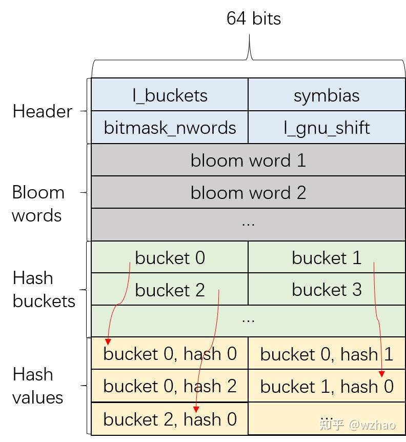

## 文档链接部分

- [动态链接器（四）：dlsym的底层实现](https://zhuanlan.zhihu.com/p/895852272)
- [linux下dlsym的文档](https://www.man7.org/linux/man-pages/man3/dlsym.3.html)


### 具体底层实现

- dlsym的实现主要涉及到elf文件中的三个section：
    - .dynsym section、.dynstr section和.gnu.hash section

#### dynsym section

```bash
采用 readelf -s ./dlsym_strlen 读取文件的符号表（symbol table）信息

显示信息部分：
    符号的地址（Value）
    符号大小（Size）
    符号类型（Type，如函数、变量等）
    符号绑定属性（Binding，如全局、局部、弱引用等）
    符号可见性（Visibility）
    符号所在节（Section）
    符号名称（Name）
```

```bash
readelf -s ./dlsym_strlen
 
Symbol table '.dynsym' contains 21 entries:
   Num:    Value          Size Type    Bind   Vis      Ndx Name
     0: 0000000000000000     0 NOTYPE  LOCAL  DEFAULT  UND 
     1: 0000000000000000     0 FUNC    GLOBAL DEFAULT  UND [...]@GLIBC_2.2.5 (2)
     2: 0000000000000000     0 FUNC    GLOBAL DEFAULT  UND _[...]@GLIBC_2.34 (3)
     3: 0000000000000000     0 FUNC    GLOBAL DEFAULT  UND [...]@GLIBC_2.2.5 (2)
     4: 0000000000000000     0 FUNC    GLOBAL DEFAULT  UND dlsym@GLIBC_2.34 (3)
     5: 0000000000000000     0 FUNC    GLOBAL DEFAULT  UND d[...]@GLIBC_2.34 (3)
     6: 0000000000000000     0 FUNC    GLOBAL DEFAULT  UND [...]@GLIBCXX_3.4 (4)
     7: 0000000000000000     0 NOTYPE  WEAK   DEFAULT  UND _ITM_deregisterT[...]
     8: 0000000000000000     0 NOTYPE  WEAK   DEFAULT  UND __gmon_start__
     9: 0000000000000000     0 NOTYPE  WEAK   DEFAULT  UND _ITM_registerTMC[...]
    10: 0000000000000000     0 FUNC    GLOBAL DEFAULT  UND [...]@GLIBCXX_3.4 (4)
    11: 00000000000011c9   103 FUNC    GLOBAL DEFAULT   16 strlen
    12: 0000000000004010     0 NOTYPE  GLOBAL DEFAULT   25 _edata
    13: 0000000000000000     0 FUNC    WEAK   DEFAULT  UND [...]@GLIBC_2.2.5 (2)
    14: 0000000000004000     0 NOTYPE  GLOBAL DEFAULT   25 __data_start
    15: 0000000000004030     0 NOTYPE  GLOBAL DEFAULT   26 _end
    16: 0000000000004000     0 NOTYPE  WEAK   DEFAULT   25 data_start
    17: 0000000000002000     4 OBJECT  GLOBAL DEFAULT   18 _IO_stdin_used
    18: 0000000000001230   356 FUNC    GLOBAL DEFAULT   16 main
    19: 00000000000010e0    38 FUNC    GLOBAL DEFAULT   16 _start
    20: 0000000000004010     0 NOTYPE  GLOBAL DEFAULT   26 __bss_start

Symbol table '.symtab' contains 47 entries:
   Num:    Value          Size Type    Bind   Vis      Ndx Name
     0: 0000000000000000     0 NOTYPE  LOCAL  DEFAULT  UND 
     1: 0000000000000000     0 FILE    LOCAL  DEFAULT  ABS Scrt1.o
     2: 000000000000038c    32 OBJECT  LOCAL  DEFAULT    4 __abi_tag
     3: 0000000000000000     0 FILE    LOCAL  DEFAULT  ABS crtstuff.c
     4: 0000000000001110     0 FUNC    LOCAL  DEFAULT   16 deregister_tm_clones
     5: 0000000000001140     0 FUNC    LOCAL  DEFAULT   16 register_tm_clones
     6: 0000000000001180     0 FUNC    LOCAL  DEFAULT   16 __do_global_dtors_aux
     7: 0000000000004010     1 OBJECT  LOCAL  DEFAULT   26 completed.0
     8: 0000000000003d88     0 OBJECT  LOCAL  DEFAULT   22 __do_global_dtor[...]
     9: 00000000000011c0     0 FUNC    LOCAL  DEFAULT   16 frame_dummy
    10: 0000000000003d78     0 OBJECT  LOCAL  DEFAULT   21 __frame_dummy_in[...]
    11: 0000000000000000     0 FILE    LOCAL  DEFAULT  ABS dlsym.cpp
    12: 0000000000004018     1 OBJECT  LOCAL  DEFAULT   26 _ZStL8__ioinit
    13: 0000000000004020     8 OBJECT  LOCAL  DEFAULT   26 _ZL8strlen_f
    14: 0000000000004028     8 OBJECT  LOCAL  DEFAULT   26 _ZL9strlen_f1
    15: 0000000000001394    86 FUNC    LOCAL  DEFAULT   16 _Z41__static_ini[...]
    16: 00000000000013ea    25 FUNC    LOCAL  DEFAULT   16 _GLOBAL__sub_I_strlen
    17: 0000000000000000     0 FILE    LOCAL  DEFAULT  ABS crtstuff.c
    18: 0000000000002248     0 OBJECT  LOCAL  DEFAULT   20 __FRAME_END__
    19: 0000000000000000     0 FILE    LOCAL  DEFAULT  ABS 
    20: 00000000000020f4     0 NOTYPE  LOCAL  DEFAULT   19 __GNU_EH_FRAME_HDR
    21: 0000000000004008     0 OBJECT  LOCAL  DEFAULT   25 __dso_handle
    22: 0000000000001404     0 FUNC    LOCAL  DEFAULT   17 _fini
    23: 0000000000001000     0 FUNC    LOCAL  DEFAULT   12 _init
    24: 0000000000003d90     0 OBJECT  LOCAL  DEFAULT   23 _DYNAMIC
    25: 0000000000004010     0 OBJECT  LOCAL  DEFAULT   25 __TMC_END__
    26: 0000000000003f90     0 OBJECT  LOCAL  DEFAULT   24 _GLOBAL_OFFSET_TABLE_
    27: 0000000000000000     0 FUNC    GLOBAL DEFAULT  UND printf@GLIBC_2.2.5
    28: 00000000000011c9   103 FUNC    GLOBAL DEFAULT   16 strlen
    29: 0000000000004010     0 NOTYPE  GLOBAL DEFAULT   25 _edata
    30: 0000000000004000     0 NOTYPE  WEAK   DEFAULT   25 data_start
    31: 0000000000002000     4 OBJECT  GLOBAL DEFAULT   18 _IO_stdin_used
    32: 0000000000000000     0 FUNC    WEAK   DEFAULT  UND __cxa_finalize@G[...]
    33: 0000000000001230   356 FUNC    GLOBAL DEFAULT   16 main
    34: 0000000000000000     0 FUNC    GLOBAL DEFAULT  UND __libc_start_mai[...]
    35: 0000000000000000     0 FUNC    GLOBAL DEFAULT  UND __cxa_atexit@GLI[...]
    36: 0000000000000000     0 FUNC    GLOBAL DEFAULT  UND dlsym@GLIBC_2.34
    37: 0000000000000000     0 FUNC    GLOBAL DEFAULT  UND dlerror@GLIBC_2.34
    38: 00000000000010e0    38 FUNC    GLOBAL DEFAULT   16 _start
    39: 0000000000004000     0 NOTYPE  GLOBAL DEFAULT   25 __data_start
    40: 0000000000004030     0 NOTYPE  GLOBAL DEFAULT   26 _end
    41: 0000000000004010     0 NOTYPE  GLOBAL DEFAULT   26 __bss_start
    42: 0000000000000000     0 FUNC    GLOBAL DEFAULT  UND _ZNSt8ios_base4I[...]
    43: 0000000000000000     0 NOTYPE  WEAK   DEFAULT  UND _ITM_deregisterT[...]
    44: 0000000000000000     0 NOTYPE  WEAK   DEFAULT  UND __gmon_start__
    45: 0000000000000000     0 NOTYPE  WEAK   DEFAULT  UND _ITM_registerTMC[...]
    46: 0000000000000000     0 FUNC    GLOBAL DEFAULT  UND _ZNSt8ios_base4I[...]
```

- .dynsym中包含了动态链接时所需的符号信息，对于动态库来说（.so文件），这个section是必须存在的。在 ELF 文件中，有两种类型的符号表：.symtab（符号表）和 .dynsym（动态符号表）。

- .symtab 包含了程序中定义和引用的所有符号的信息，包括局部符号和全局符号。它对于调试和链接过程（这里的链接是指对.o文件的链接）非常有用，但并不需要在程序运行时被加载到内存中。

    - 与 .symtab 相比，.dynsym 只包含了与动态链接相关的符号信息，它是 .symtab 的一个子集。.dynsym 中通常包含了动态库中定义的全局符号，这些符号在程序运行时可能会被使用，动态链接器需要使用.dynsym 在运行时获得符号的信息，因此.dynsym需要在程序运行时被加载到内存中。
    - 在某些情况下，为了减少二进制文件的大小，可能会使用 strip 命令移除 .symtab 信息，但 .dynsym 会被保留，因为它对于程序的运行是必需的。

```cpp
typedef struct
{
 Elf64_Word st_name;    /* Symbol name (string tbl index) */
 unsigned char st_info;    /* Symbol type and binding */
 unsigned char st_other;   /* Symbol visibility */
 Elf64_Section st_shndx;   /* Section index */
 Elf64_Addr st_value;   /* Symbol value */
 Elf64_Xword st_size;    /* Symbol size */
} Elf64_Sym;
```
-  以64位的ELF为例，.dynsym中保存着一个Elf64_Sym数组，Elf64_Sym的各个字段的作用如下：
    - st_name：符号名在.dynstr或.strtab中的索引（如果是.dynsym中保存的Elf64_Sym结构体，那么保存的就是.dynstr中的索引）。
    - st_info：低4位保存符号的类型（例如，是否是函数、对象、文件等），高4位保存符号的binging（例如，局部、全局、弱等）。
    - st_other：符号的可见性。
    - st_shndx：符号所在的section的索引。
    - st_value：符号的值或地址。对于动态库，这里的地址指的是符号相对于动态库基地址的偏移（基地址通常是0）。
    - st_size：符号的大小。

#### .dynstr section
- .dynstr 包含了动态链接器在运行时解析动态符号时所需的字符串，这个section也是动态库中必须存在的。.dynstr 节中的字符串通常以空字符（\0）结尾，这些字符串通常是符号的名称（函数名或全局变量名）。

```bash
readelf -p .dynstr ./dlsym_strlen 

String dump of section '.dynstr':
  [     1]  __gmon_start__
  [    10]  _ITM_deregisterTMCloneTable
  [    2c]  _ITM_registerTMCloneTable
  [    46]  _ZNSt8ios_base4InitD1Ev
  [    5e]  _ZNSt8ios_base4InitC1Ev
  [    76]  dlerror
  [    7e]  __cxa_finalize
  [    8d]  __libc_start_main
  [    9f]  dlsym
  [    a5]  __cxa_atexit
  [    b2]  strlen
  [    b9]  printf
  [    c0]  libstdc++.so.6
  [    cf]  libc.so.6
  [    d9]  _edata
  [    e0]  _IO_stdin_used
  [    ef]  __data_start
  [    fc]  _end
  [   101]  __bss_start
  [   10d]  GLIBCXX_3.4
  [   119]  GLIBC_2.34
  [   124]  GLIBC_2.2.5
```

- .dynstr 节是 .dynsym 的辅助节，.dynsym 节包含了**动态链接需要的符号**，而 .dynstr 节则包含了这些符号的名称，动态链接器在寻找符号时会将这两个节配合使用——.dynsym 节中的每个符号条目都会包含一个字符串表索引（之前提到的st_name字段），该索引指向 .dynstr 中的一个字符串，即符号的名称。这样，当动态链接器需要查找或解析一个符号时，它可以使用 .dynsym 中的信息和 .dynstr 中的字符串来确定符号的具体名称。


#### .gnu.hash section

- **.gnu.hash用于在动态链接时加速符号的查找过程**。这个节是一个哈希表，**它存储了.dynsym中符号的哈希值，以便在动态链接器查找符号时能够快速确定符号是否存在于对象中。**

- .gnu.hash 节通常包含以下四个部分：

    - Header：包含四个条目，每个条目占用4个字节，分别是：
        - nbuckets：哈希桶的数量，决定了哈希桶数组的大小。
        - symndx：动态符号表中可以通过哈希表访问的第一个符号的索引。
        - maskwords：布隆过滤器中使用的字数，决定了布隆过滤器的大小。
        - shift2：布隆过滤器使用的移位计数。

    - Bloom Filter：用于快速检查一个符号是否可能存在于哈希表中。布隆过滤器是一种空间效率很高的概率型数据结构，用于测试一个元素是否是一个集合的成员。

    - Hash Buckets：包含一系列桶，每个桶包含一个.dynsym中符号的索引。

    - Hash Values：包含.dynsym中符号的哈希值。（Hash Values中并不包含.dynsym中所有符号的hash值，其包含hash值的个数=.dynsym中符号的个数-symndx）




## 具体实现方式部分

- 当程序调用dlsym时，动态链接器就会使用.dynsym、.dynstr和.gnu.hash这三个section来查找动态库中dlsym参数传入的符号名所对应的符号。


**总体步骤**

    - 计算dlsym传入的字符串参数symbol的hash值（记作symbol_hash）。
    - 使用symbol_hash检查布隆过滤器，以确定是否有可能存在该符号。
    - 如果布隆过滤器表示符号可能存在，链接器会找到symbol_hash所对应的哈希桶，从而获得hash桶中保存的.dynsym中符号的索引dynsym_idx。
    - 令chain_idx=dynsym_idx-symndx。（symndx是前文所提到的.dynsym中可以通过哈希表访问的第一个符号的索引）
    - 使用chain_idx作为Hash values的开始索引（可以说找到了哈希桶对应的chain），之后以索引不断+1的方式，比较symbol_hash和当前索引处Hash values中保存的hash值（将后者记作chain_hash），如果symbol_hash等于chain_hash，再比较符号名是否相同，直到找到符号或哈希桶所对应的chain结束（chain_hash&1!=1成立时表示chain结束）。


### 具体代码实现细节部分

```rust
struct SymbolData {
    /// .gnu.hash
    pub hashtab: ELFGnuHash,
    /// .dynsym
    pub symtab: *const ELFSymbol,
    /// .dynstr
    pub strtab: ELFStringTable<'static>,
    #[cfg(feature = "version")]
    /// .gnu.version
    pub version: Option<version::ELFVersion>,
}

// self的类型是SymbolData
pub(crate) fn get_sym(&self, symbol: &SymbolInfo) -> Option<&ELFSymbol> {
    let hash = ELFGnuHash::gnu_hash(symbol.name.as_bytes());
    let bloom_width: u32 = 8 * size_of::<usize>() as u32;
    let bloom_idx = (hash / (bloom_width)) as usize % self.hashtab.blooms.len();
    let filter = self.hashtab.blooms[bloom_idx] as u64;
    if filter & (1 << (hash % bloom_width)) == 0 {
        return None;
    }
    let hash2 = hash.shr(self.hashtab.nshift);
    if filter & (1 << (hash2 % bloom_width)) == 0 {
        return None;
    }
    let table_start_idx = self.hashtab.table_start_idx as usize;
    let chain_start_idx = unsafe {
        self.hashtab
            .buckets
            .add((hash as usize) % self.hashtab.nbucket as usize)
            .read()
    } as usize;
    if chain_start_idx == 0 {
        return None;
    }
    let mut dynsym_idx = chain_start_idx;
    let mut cur_chain = unsafe { self.hashtab.chains.add(dynsym_idx - table_start_idx) };
    let mut cur_symbol_ptr = unsafe { self.symtab.add(dynsym_idx) };
    loop {
        let chain_hash = unsafe { cur_chain.read() };
        if hash | 1 == chain_hash | 1 {
            let cur_symbol = unsafe { &*cur_symbol_ptr };
            let sym_name = self.strtab.get(cur_symbol.st_name as usize);
            #[cfg(feature = "version")]
            if sym_name == symbol.name && self.check_match(dynsym_idx, &symbol.version) {
                return Some(cur_symbol);
            }
            #[cfg(not(feature = "version"))]
            if sym_name == symbol.name {
                return Some(cur_symbol);
            }
        }
        if chain_hash & 1 != 0 {
            break;
        }
        cur_chain = unsafe { cur_chain.add(1) };
        cur_symbol_ptr = unsafe { cur_symbol_ptr.add(1) };
        dynsym_idx += 1;
    }
    None
}
```

-------------------------------------------------- 

#### 在 ELF（Executable and Linkable Format）文件中，`.dynsym` 和 `.symtab` 都是存储符号信息的段，但它们的用途、包含的内容和使用场景有显著区别：

### 1. 基本定义
- **`.symtab`（Symbol Table，符号表）**  
  存储**所有符号**的完整信息，包括编译/链接过程中用到的局部符号、全局符号、调试符号等。

- **`.dynsym`（Dynamic Symbol Table，动态符号表）**  
  仅存储**动态链接时需要的符号**（如外部共享库引用的符号、需要导出给其他模块的符号），是 `.symtab` 的子集。


### 2. 核心区别
| 特性                | `.symtab`                          | `.dynsym`                          |
|---------------------|------------------------------------|------------------------------------|
| **包含符号范围**    | 全部符号（局部、全局、调试等）     | 仅动态链接相关符号（精简版）       |
| **用途**            | 编译、链接、调试（如 `nm` 命令默认读取） | 运行时动态链接（如 `ld.so` 加载器使用） |
| **存在场景**        | 可执行文件、目标文件（.o）、共享库均可能包含 | 仅动态链接的文件（可执行文件、共享库） |
| **大小**            | 较大（完整符号集）                 | 较小（仅必要符号）                 |
| **依赖的字符串表**  | 通常对应 `.strtab`                 | 通常对应 `.dynstr`                 |


### 3. 典型使用场景
- **`.symtab`**：  
  开发阶段用于调试（如 `gdb` 查看变量/函数信息）、静态链接（`ld` 链接器解析符号）、符号分析（`nm` 命令默认显示 `.symtab` 内容）。  
  **注意**：发行版的可执行文件可能会剥离 `.symtab` 以减小体积（使用 `strip` 命令）。

- **`.dynsym`**：  
  运行阶段用于动态链接：当程序加载时，动态链接器（`ld.so`）通过 `.dynsym` 查找共享库中的符号（如 `printf` 等标准库函数），或导出本模块的符号供其他共享库使用。  
  即使 `.symtab` 被剥离，`.dynsym` 通常也会保留（否则程序无法动态链接）。


### 4. 总结
简单来说：  
- `.symtab` 是“全量符号表”，服务于开发和静态链接；  
- `.dynsym` 是“动态符号表”，服务于运行时的动态链接，是精简且必要的符号集合。  

可以通过 `readelf -s`（查看 `.symtab`）和 `readelf -d` 结合 `readelf --dyn-syms`（查看 `.dynsym`）对比两者的内容。