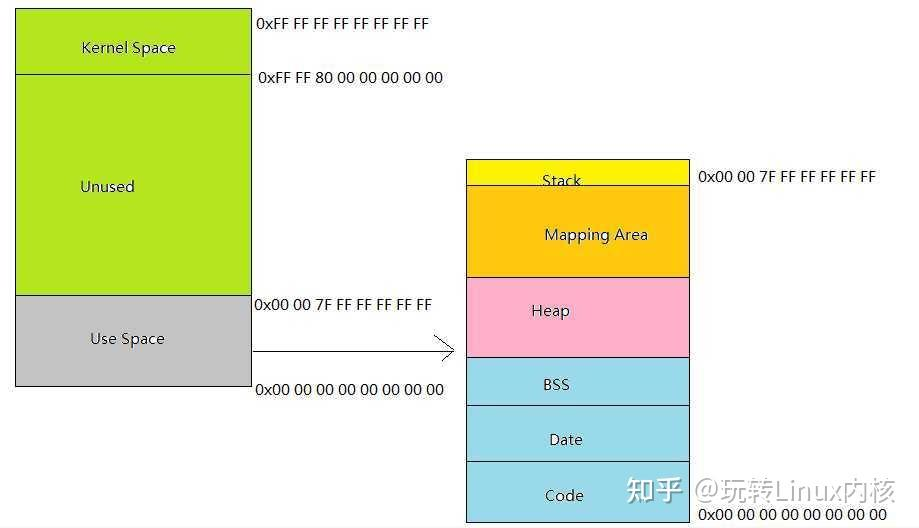
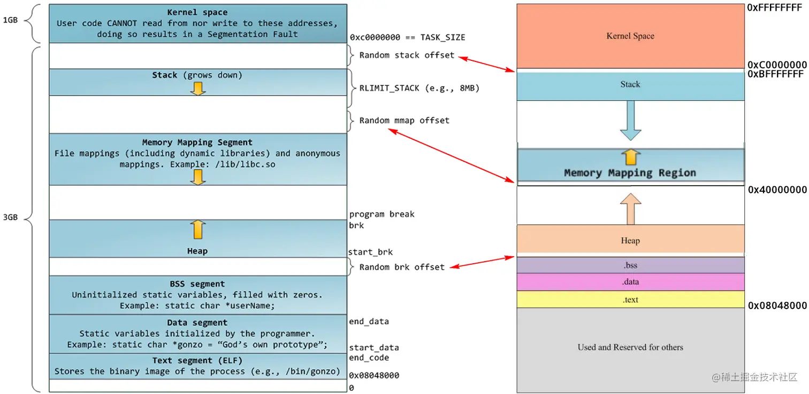
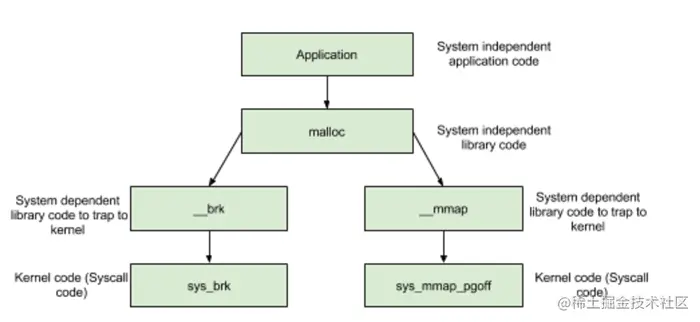

## 基本的参考

- [内存分配不再神秘：深入剖析malloc函数实现原理与机制](https://zhuanlan.zhihu.com/p/643112072)
- [深入剖析malloc-free底层原理](https://juejin.cn/post/7234450421888548921)

#### 内存分配的方式

- 从静态存储区分配，生命周期随程序的结束而结束，比如全局变量，静态变量。
- 从栈空间分配，函数调用结束后自动释放。
- 从堆空间分配，即动态内存开辟，如malloc、calloc、realloc。


- `malloc分配的内存大小至少为参数所指定的字节数，malloc的返回值是一个指针，指向一段可用内存的起始位置，指向一段可用内存的起始地址`，多次调用malloc所分配的地址不能有重叠部分，除非某次malloc所分配的地址被释放掉malloc应该尽快完成内存分配并返回（不能使用NP-hard的内存分配算法）实现malloc时应同时实现内存大小调整和内存释放函数（realloc和free） malloc和free是配对的，如果申请后不释放就是内存泄露，如果无故释放那就是什么也没做，释放只能释放一次，如果一块空间释放两次或者两次以上会出现错误, 但是释放空指针例外，释放空指针也等于什么也没做，所以释放多少次都是可以的。

#### new 和 malloc对比

- new返回指定类型的指针，并且可以自动计算所需要的大小。

```cpp
int *p;
p = new int;//返回类型为int* ，分配的大小是sizeof(int)
p = new int[100];//返回类型是int*类型，分配的大小为sizeof(int)*100
```
- 而malloc需要我们自己计算字节数，并且返回的时候要强转成指定类型的指针。

```cpp
int *p;
p = (int *)malloc(sizeof(int));
```

    - malloc的返回是void*,如果我们写成了：p=malloc(sizeof(int));间接的说明了（将void转化给了int*，这不合理）
    - malloc的实参是sizeof(int)，用于指明一个整型数据需要的大小，如果我们写成p=(int*)malloc(1),那么可以看出：只是申请了一个一个字节大小的空间。
    - malloc只管分配内存，并不能对其进行初始化，所以得到的一片新内存中，其值将是随机的。

- `malloc函数其实就是在内存中找一片指定大小的空间，然后将这个空间的首地址给一个指针变量，这里的指针变量可以是一个单独的指针，也可以是一个数组的首地址，这要看malloc函数中参数size的具体内容。我们这里malloc分配的内存空间在逻辑上是连续的，而在物理上可以不连续。我们作为程序员，关注的是逻辑上的连续，其他的操作系统会帮着我们处理。`


## malloc实现原理



- 对用户来说主要关心的是User Space。将User Space放大后，可以看到里面主要分成如下几段：
    - Code：这是整个用户空间的最低地址部分，存放的是指令（也就是程序所编译成的可执行机器码） Data：这里存放的是初始化过的全局变量
    - BSS：这里存放的是未初始化的全局变量
    - Heap：堆，这是我们本文主要关注的地方，堆自底向上由低地址向高地址增长
    - Mapping Area：这里是与mmap系统调用相关的区域。大多数实际的malloc实现会考虑通过mmap分配较大块的内存空间，本文不考虑这种情况，这个区域由高地址像低地址增长 Stack:栈区域，自高地址像低地址增长 。
    - Heap内存模型：一般来说，malloc所申请的内存主要从Heap区域分配，来看看Heap的结构是怎样的。
- `Linux维护一个break指针，这个指针执行堆空间的某个地址，从堆开始到break之间的地址空间为映射好的，可以供进程访问，而从break往上，是未映射的地址空间，如果访问这段空间则程序会报错。`

#### brk与sbrk

- 由上文知道，要增加一个进程实际上的可用堆大小，就需要将break指针向高地址移动。Linux通过brk和sbrk系统调用操作break指针。两个系统调用的原型如下：

```cpp
int brk(void *addr);
void *sbrk(inptr_t increment);
```

- `brk将break指针直接设置为某个地址，而sbrk将break从当前位置移动increment所指定的增量。`brk在执行成功时返回0，否则返回-1并设置为errno为ENOMEM,sbrk成功时返回break移动之前所指向的地址，否则返回（void*）-1;

##### 资源限制与rlimit

- `系统为每一个进程所分配的资源不是无限的，包括可映射的空间，因此每个进程有一个rlimit表示当前进程可用的资源上限，这个限制可以通过getrlimit系统调用得到，下面代码获取当前进程虚拟内存空间的rlimit 其中rlimt是一个结构体`

```cpp
struct rlimit
{
    rlimt_t rlim_cur;
    rlim_t rlim_max;
};
```

- 每种资源有硬限制和软限制，并且可以通过setrlimit对rlimit进行有条件限制作为软限制的上限，非特权进程只能设置软限制，且不能超过硬限制.

### 实现malloc部分

#### 对应数据结构

- 首先我们要确定所采用的数据结构。`一个简单可行方案是将堆内存空间以块的形式组织起来，每个块由meta区和数据区组成，meta区记录数据块的元信息（数据区大小、空闲标志位、指针等等），数据区是真实分配的内存区域，并且数据区的第一个字节地址即为malloc返回的地址，可以使用如下结构体定义一个block。`

```cpp
typedef struct s_block *t_block;
struck s_block{
    size_t size;//数据区大小
    t_block next;//指向下个块的指针
    int free;//是否是空闲块
    int padding;//填充4字节，保证meta块长度为8的倍数
    char data[1];//这是一个虚拟字段，表示数据块的第一个字节，长度不应计入meta
};
```

#### 寻找适合的block
- 现在考虑如何在block链中查找合适的block。一般来说有两种查找算法： `First fit:从头开始，使用第一个数据区大小大于要求size的块所谓此次分配的块 Best fit:从头开始，遍历所有块，使用数据区大小大于size且差值最小的块作为此次分配的块 两种方式各有千秋，best fit有较高的内存使用率（payload较高），而first fit具有较高的运行效率。这里我们采用first fit算法`

```cpp
t_block find_block(t_block *last,size_t size){
    t_block b = first_block;
    while(b&&b->size>=size)
    {
        *last = b;
        b = b->next;
    }
    return b;
}
```

- `find_block从first_block开始，查找第一个符合要求的block并返回block起始地址，如果找不到这返回NULL，这里在遍历时会更新一个叫last的指针，这个指针始终指向当前遍历的block.这是为了如果找不到合适的block而开辟新block使用的。`

#### 开辟新的block

- 如果现有block都不能满足size的要求，则需要在链表最后开辟一个新的block。这里关键是如何只使用sbrk创建一个struct：

```cpp
#define BLOCK_SIZE 24

t_block extend_heap{
    t_block b;
    b = sbrk(0);
        if(sbrk(BLOCK_SIZE+s)==(void*)-1)
        return NULL;
        b->size = s;
        b->next - NULL;
        if(last)
        last->next = b;
        b->free = 0;
        return b;
};
```

#### 分裂block

- First fit有一个比较致命的缺点，就是可能会让更小的size占据很大的一块block，此时，为了提高payload,应该在剩余数据区足够大的情况下，将其分裂为一个新的block：

```cpp
void split_block(t_block b,size_t s)
{
    t_block new;
    new = b->data;
    new->size = b->size-s-BLOCK_SIZE;
    new->next = b->next;
    new ->free = 1;
    b->size = s;
    b->next = new;
}
```

#### 对应malloc实现部分

```cpp
size_t align8(size_t s)
{
    if(s&0x7 == 0)
    return s;
    return ((s>>3)+1)<<3;
}
#define BLOCK_SIZE 24
void *first_block=NULL;
void *mallloc(size_t size)
{
    t_block b,last;
    size_t s;
    //对齐地址
    s = align8(size);
    if(first_block)
    //查找适合block
    last = first_block;
    b = find_block(&last,s);
    if(b)
    {
    //如果可以则分裂
    if((b->size-s)>=(BLOCK_SIZE + 8))
    split_block(b,s);
    b->free = 0;
    }
    else
    {
        //没有合适的block，开辟一个新的
        b=extend_heap(last,s);
        if(!b)
        {
            return NULL;
        }
        else
        {
            b=extend_heap(NULL,s);
            if(!b)
            {
                return NULL;
            }
            first_block = b;
        }
    }
    return b->data;
}
```

## malloc内存的由来

- 由于虚拟内存的存在，每个进程都好像是独占用户空间的。内核除了管理自身的内存之外，也需要管理用户空间里进程的内存，这个内存又叫做进程地址空间。

- 在32位系统中，可寻址的范围是4g，在linux系统当中，内核占1g（3-4g），用户空间占3g（0-3g）。

- 在linux系统当中，内核使用进程描述符结构体来表示进程地址空间。 该结构包括了和进程地址空间有关的全部信息。

- 内存描述符由mm_struct结构体表示

```cpp
///include/linux/sched.h 

struct mm_struct {
  struct vm_area_struct * mmap;  /* 指向虚拟区间（VMA）链表 */
  rb_root_t mm_rb;         /*指向red_black树*/
  struct vm_area_struct * mmap_cache;     /* 指向最近找到的虚拟区间*/
  pgd_t * pgd;             /*指向进程的页目录*/
  atomic_t mm_users;                   /* 用户空间中的有多少用户*/                                     
  atomic_t mm_count;               /* 对"struct mm_struct"有多少引用*/                                     
  int map_count;                        /* 虚拟区间的个数*/
  struct rw_semaphore mmap_sem;
  spinlock_t page_table_lock;        /* 保护任务页表和 mm->rss */       
  struct list_head mmlist;            /*所有活动（active）mm的链表 */
  unsigned long start_code, end_code, start_data, end_data; /* 代码段、数据段 起始地址和结束地址 */
  unsigned long start_brk, brk, start_stack; /* 栈区 的起始地址，堆区 起始地址和结束地址 */
  unsigned long arg_start, arg_end, env_start, env_end; /*命令行参数 和 环境变量的 起始地址和结束地址*/
  unsigned long rss, total_vm, locked_vm;
  unsigned long def_flags;
  unsigned long cpu_vm_mask;
  unsigned long swap_address;

  unsigned dumpable:1;
  /* Architecture-specific MM context */
  mm_context_t context;
};
```

- 具体每个成员的含义可以查阅《Linux内核设计与实现》第15章。



- mmap内存段的的作用就是：`内核将硬盘上的数据直接映射到内存，任何应用程序都可以通过系统调用mmap()函数来实现这种映射。`

- 其中，`start_brk和brk分别是堆的起始位置和终止位置，而我们用malloc和new分配内存的时候，就是在这段内存区域上进行的。  堆的大小是确定的，但是如果不够用的话，也可以通过系统调用brk()来增加堆的空间，但是这样做是有代价的，因为涉及到用户态和内核态的状态切换。`

#### malloc涉及的mmap操作

-  mmap（）有两种映射方法，可以将硬盘上的文件映射到内存上去，也可以创建匿名映射。
-  malloc采用的是匿名映射。 匿名映射就是不映射文件，而是直接向映射区mmap区申请一块内存。
**malloc分配小内存的话，调用sbrk系统调用，分配大内存的话，就直接使用mmap系统调用直接映射！！！！  注意，malloc分配内存之后，只是分配了虚拟内存，还没有映射到物理内存，只有当访问申请的内存的时候，才会发生缺页中断，分配对应的物理内存！！！**



- 分配内存 < DEFAULT_MMAP_THRESHOLD，走__brk，从内存池获取，失败的话走brk系统调用
- 分配内存 > DEFAULT_MMAP_THRESHOLD，走__mmap，直接调用mmap系统调用
- DEFAULT_MMAP_THRESHOLD默认是128k，当然也可以调整。

#### malloc还要涉及到内存池部分


